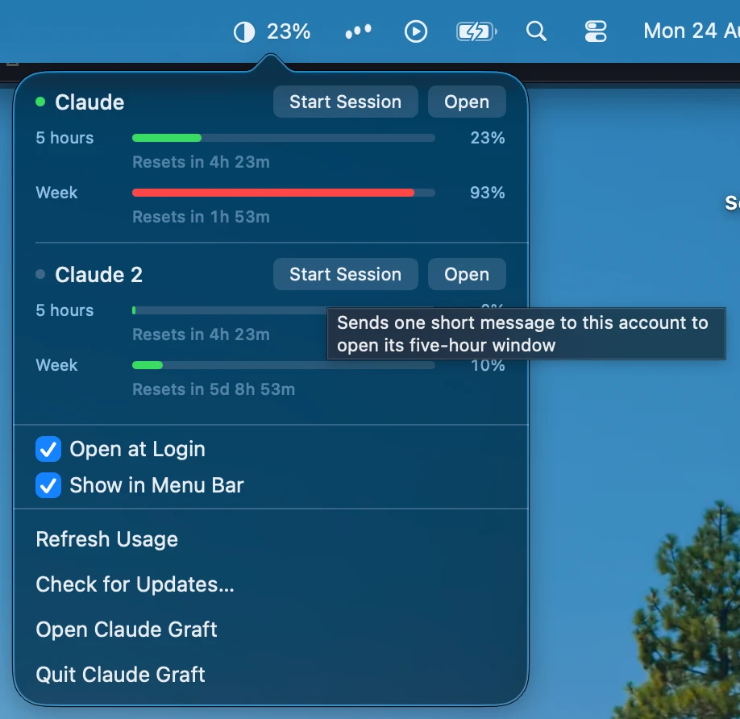
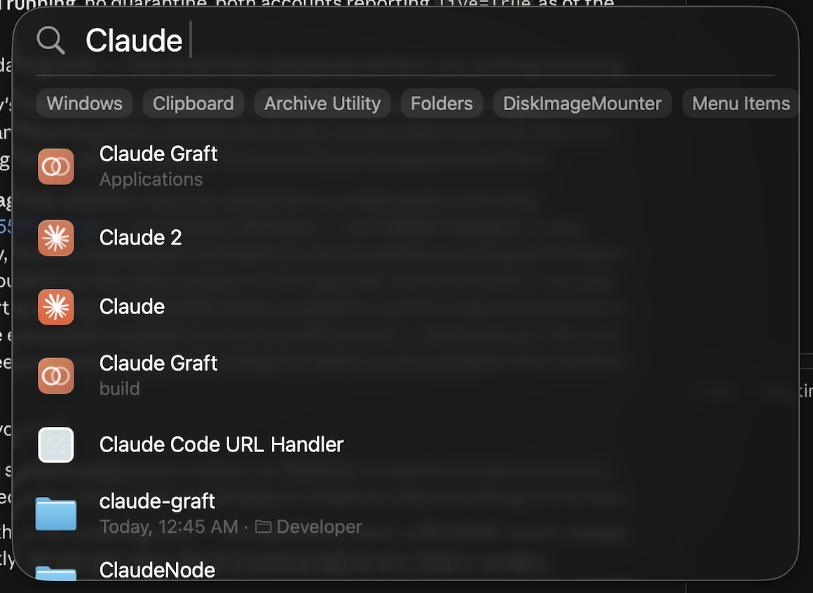
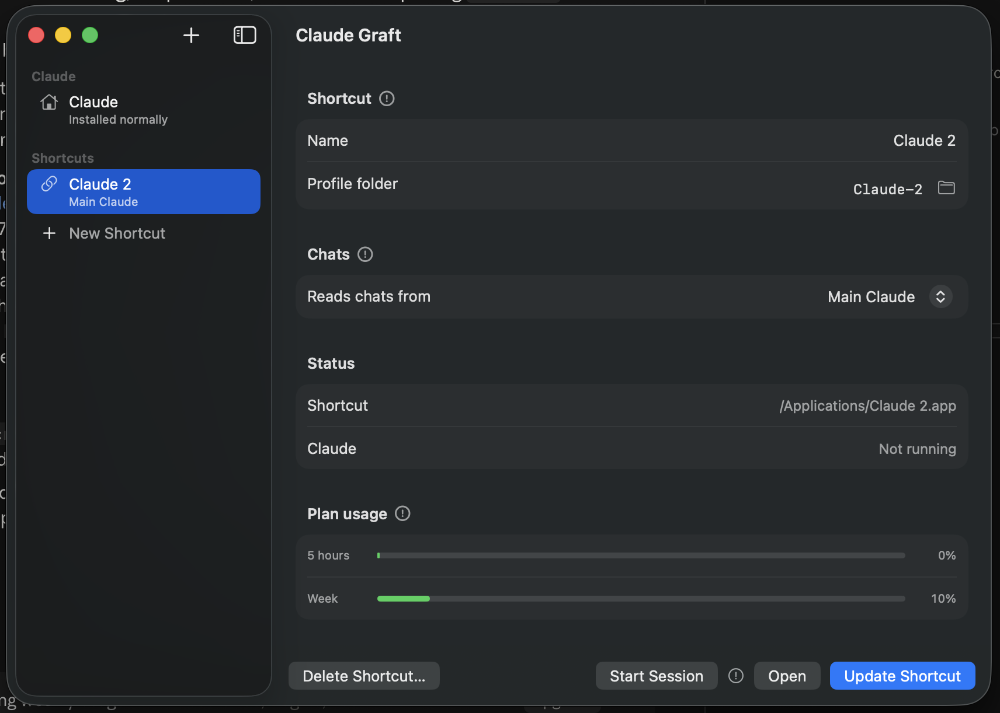

# Claude Graft

**1× is less but 5× is too much.** *(Or 20× is less, lol.)*

One Claude login is never quite the right amount.

Claude Desktop signs into one account at a time. Graft gives you as many Claudes
as you want — each with its own name, icon and login — and lets any of them read
another one's Claude Code history.

That last part is the point. Every other way of running two accounts gives you
an empty second profile. Graft lets your work login open your personal chats,
connectors and extensions while the accounts stay completely separate.

There are screenshots and the short version at
**[claude-graft](https://aaditya-v-more.github.io/claude-graft/)**.



## Install

```
brew install --cask aaditya-v-more/claude-graft/claude-graft
```

Homebrew asks you to trust the cask the first time, because this isn't an
official Homebrew tap. Say yes once and it never asks again.

The app is ad-hoc signed rather than notarised — that needs a paid Apple
developer account — so macOS would normally refuse it. The cask clears the
quarantine flag for you at install time; the command it runs is right there in
the cask file. If you'd rather judge that yourself, take the **.dmg** from the
[releases page](https://github.com/aaditya-v-more/claude-graft/releases) and
allow it in System Settings → Privacy & Security instead.

Requires macOS 13 or later. Universal, for Apple Silicon and Intel.

## Making a Claude

Name it, choose where its chats come from, press **Create Shortcut**. You get a
real app in `/Applications` that you can launch from Spotlight or pin to the
Dock like any other.



Launch it, sign in with the other account, and both run side by side.



Each shortcut is self-contained — it carries its own launcher and a description
of its profile — so it keeps working whether or not Graft is installed or
running. Every launch re-establishes its links first, which matters because
Claude replaces some config files wholesale, and that quietly detaches a
symlink.

Point the profile folder at one that already exists and the shortcut adopts it,
which saves signing in again if you set something up by hand.

## Usage in the menu bar

The percentage in the bar is whichever account is currently open, with the rest
behind the tooltip. Figures come from Anthropic's own endpoint using the login
each profile already holds — so they're live even for an account that isn't
running, with real reset times.

Reaching that needs the profile's token, which macOS gates behind one keychain
prompt. Choose **Always Allow** and later reads are silent. macOS ties that
permission to one exact build, so a new version asks again — once, rather than
quietly showing you worse numbers.

Only the access token is ever decrypted, never the refresh token, because
Anthropic rotates those and using one would sign Claude Desktop out. Nothing is
written back to Claude's config or keychain, and the token goes to
`api.anthropic.com` and nowhere else.

**Start Session** opens a five-hour window on an account without switching to
it: one short message, `max_tokens` as low as the API allows, reply discarded.
It costs a handful of tokens and happens only because you pressed the button.

## Updating

Graft updates itself. It checks hourly, and at launch when an hour has passed,
then downloads, installs and restarts on its own — the only sign is the menu bar
item blinking out and back. Every download is verified against a signing key
that ships inside the app. **Check for Updates…** does it immediately if you'd
rather not wait.

## Worth knowing

Two Claudes sharing a chat store write to the same files, so opening the *same*
conversation in both at once can lose messages. Opening one from Graft — the
window or the menu bar, a shortcut or Claude itself — warns you when something
else is already on those chats. Launching it from the Dock doesn't check.

Opening a Claude that is already open brings that one forward instead of
starting a second. Claude Desktop itself doesn't refuse a second copy on the
same profile, and two copies of one profile is the worst version of the problem
above — not two accounts sharing chats, but the very same files being written
twice over. If you've closed the window and left it in the menu bar, opening it
builds the window back, the way clicking a Dock icon does.

Borrowed chats can be read from the profile that borrowed them, but not changed.
Archive one of the source account's conversations from a grafted Claude and it
leaves that window's sidebar and comes back on the next launch: Claude Desktop
writes a conversation's record only for the account it is signed into, so the
archive is never saved anywhere. Archive it from the Claude that owns the
account and it sticks everywhere, that profile included.

Which account owns a conversation is not decided by the window you start it in.
Claude Code keeps one login for the whole machine, and whichever account that is
gets stamped on every session, whichever Claude it was typed into — so a chat
begun in a second profile still belongs to the account the command line is
signed in as, and only that account's Claude can archive or rename it.

`~/.claude` — settings, `CLAUDE.md`, skills, plugins, MCP servers, transcripts —
is already shared by every instance, since it comes from `$HOME` rather than the
profile.

Claude Code prunes transcripts after 30 days while the desktop's records are
permanent, so old chats can open to "Session not found on disk". That happens in
a normal single-account setup too; raise `cleanupPeriodDays` in
`~/.claude/settings.json` to keep them longer.

Deleting a shortcut asks whether to take the profile folder with it. Keeping it
is the default, and the destructive option is guarded: Claude's own profile can
never be removed, nor anything outside `~/Library/Application Support`, nor a
profile that's running or that another shortcut still points at. Graft also
refuses to touch any app it didn't create — it identifies its own by the
description file they carry, never by name.

## Building it

```
./build.sh     the app, into build.noindex/
./test.sh      246 checks, all in a throwaway directory
./release.sh   tests, builds universal, signs, packages
```

Swift toolchain from Xcode, no project file, no dependencies to install —
Sparkle is fetched into `vendor/` on the first build, pinned to a version and a
checksum. The version lives in one file, `VERSION`.

`CLAUDE.md` has the notes that aren't obvious from the code: what Claude Desktop
keeps where, the rules around borrowed credentials, and the several things that
had to go wrong before this worked. Read it before changing anything that
touches profiles, the keychain or the menu bar.

## Supporting it

Free, and staying that way — no licence to buy, no account to make, nothing
measured and sent anywhere. If it saved you the trouble, there's a
[tip jar](https://ko-fi.com/aadityavmore). New macOS releases break things and
Claude Desktop moves its own furniture every few weeks, and that's what the
money is for.

## Licence

MIT.
