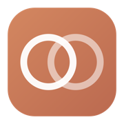
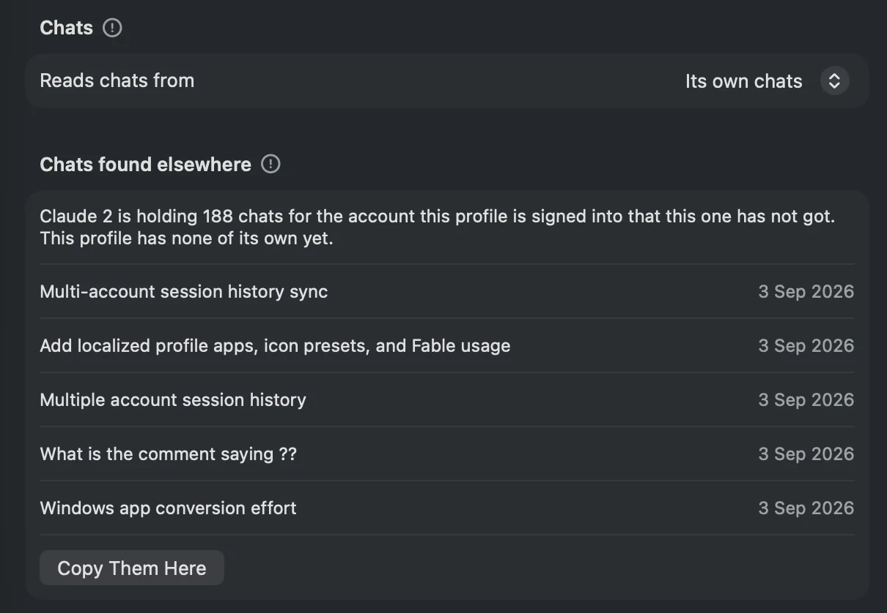

<div align="center">



<h1>Claude Graft</h1>

<p>
  <b>1× is less but 5× is too much.</b> <i>(Or 20× is less, lol.)</i><br>
  One Claude login is never quite the right amount.
</p>

<p>
  <a href="https://github.com/aaditya-v-more/claude-graft/releases/latest"></a>
  <a href="https://github.com/aaditya-v-more/claude-graft/releases"></a>
  <a href="https://github.com/aaditya-v-more/homebrew-claude-graft"></a>
  
  <a href="https://github.com/aaditya-v-more/claude-graft/stargazers"></a>
  <a href="LICENSE"></a>
  <a href="https://ko-fi.com/aadityavmore"></a>
</p>

<p>
  <a href="https://aaditya-v-more.github.io/claude-graft/"><b>Website</b></a>
  &nbsp;·&nbsp;
  <a href="#install"><b>Install</b></a>
  &nbsp;·&nbsp;
  <a href="https://github.com/aaditya-v-more/claude-graft/releases"><b>Releases</b></a>
</p>

<br>


</div>

Claude Desktop signs into one account at a time. Graft gives you as many Claude
profiles as you want — each shortcut with its own name and icon, each profile
with its own login — and lets any of them read another one's Claude Code history.

That last part is the point. Every other way of running two accounts gives you
an empty second profile. Graft lets your work login open your personal chats,
connectors and extensions while the accounts stay completely separate. There are
screenshots and the short version on
[the site](https://aaditya-v-more.github.io/claude-graft/).

## Before you install

Graft launches Claude Desktop with separate profile folders, so Claude Desktop
has to be installed first — in `/Applications`, or in `~/Applications` if that
is where you keep it. Graft installs it for you no more than it signs you in.

macOS 13 or later. Universal, for Apple Silicon and Intel.
The interface follows the macOS language, with English and Russian included.
The shared-sidebar flow has been tested with Claude Desktop 2.110.1 on macOS 27.

## Install

```
brew install --cask aaditya-v-more/claude-graft/claude-graft
```

Homebrew asks you to trust the cask the first time, because this isn't an
official Homebrew tap. Say yes once and it never asks again.

The app is ad-hoc signed rather than notarised — that needs a paid Apple
developer account — so macOS would normally refuse it. The cask clears the
quarantine flag for you at install time; the command it runs is right there in
the cask file. If you'd rather judge that yourself, take the **.dmg** from the
[releases page](https://github.com/aaditya-v-more/claude-graft/releases) and
allow it in System Settings → Privacy & Security instead.

## Making a Claude

Name it, choose one of twelve icon variations and where its chats come from,
then press **Create Shortcut**. You get a small generated shortcut app in
`/Applications` that you can open from Spotlight or pin to the Dock. Graft does
not copy or modify the installed Claude bundle.

The custom name and icon belong to that shortcut. Once it opens Claude, macOS
shows the running stock Claude name and icon; changing the runtime identity
would require modifying or re-signing Anthropic's app.


Launch it, sign in with the other account, and both run side by side.


Each shortcut is self-contained — it carries its own launcher and a description
of its profile — so it keeps working whether or not Graft is installed or
running. Every launch re-establishes its links first, which matters because
Claude replaces some config files wholesale, and that quietly detaches a
symlink.

Point the profile folder at one that already exists and the shortcut adopts it,
which saves signing in again if you set something up by hand.

## Bringing over chats from a previous login

Sign a new shortcut into an account you used to reach by signing out of Claude
and back in, and its sidebar comes up empty. Nothing has been lost. A chat store
is keyed by account and each Claude reads only the folder for the account it
holds, so both histories are sitting in the profile you did the switching in,
and the new shortcut simply has none of its own yet.

Graft notices and says so: which profile is holding them, how many, and the last
few titles with the dates they were last active. It offers to bring them over
from the shortcut's own view, and asks again when you press **Open**, where the
question can be turned off for good. The offer stays in the window either way,
so you can decide later rather than now.



Quit every Claude first, this profile's and every other one. An instance builds
its sidebar as it starts and rewrites records as it runs, so anything copied
underneath a running one is invisible at best. Graft checks, refuses, and names
what to close.

The originals stay exactly where they are. Nothing is taken out of the profile
they came from, so it still has them if you sign back into that account there,
and nothing already in this profile is written over. That is why the offer also
stands for a profile that has chats of its own — the two sets are merged rather
than either replacing the other — and why the count is always what this profile
is missing, so it is the number that actually arrives.

This is not the chat sharing below, which points one profile at another's
history and keeps them in step. This is that account's own chats going to the
profile signed into it, once.

## Usage in the menu bar

The bar shows whichever account is currently open, the rest behind the tooltip.
Figures come from Anthropic's own endpoint using the login each profile already
holds, so they're live with real reset times even for an account that isn't
running. When Anthropic reports a scoped Fable limit, it appears as a third bar.

Reading that token needs one keychain prompt: choose **Always Allow** and later
reads are silent. macOS ties the permission to one exact build, so a new version
asks again — once, rather than quietly showing you worse numbers.

Only the access token is ever decrypted, never the refresh token, which
Anthropic rotates and which would sign Claude Desktop out. Nothing is written
back to Claude's config or keychain, and the token goes to `api.anthropic.com`
and nowhere else.

**Start Session** opens a five-hour window on an account without switching to
it — one short message, `max_tokens` as low as the API allows, reply discarded.
A handful of tokens, and only because you pressed the button.

## Updating

Graft updates itself: hourly, and at launch once an hour has passed, it
downloads, installs and restarts on its own, the only sign being the menu bar
item blinking out and back. Every download is verified against a signing key
that ships inside the app. **Check for Claude Graft Updates** does it immediately.

Claude Desktop can restart itself to update while an unfinished workflow is
waiting for input. Turn on **Update Claude Desktop manually** in Graft's menu
bar or Settings to prevent these automatic updates in Claude and every
shortcut. It takes effect when each Claude next starts; finish your work before
restarting any instance already open. Graft checks Claude's update service at
launch and hourly, including while Claude instances are running. A new version
appears in the window and menu bar, and the menu bar icon becomes an exclamation
mark. **Check for Claude Updates** checks immediately.

**Update Claude…** first warns that every running Claude will close and its
workflows will stop. Cancel leaves them running. Confirming rechecks the release,
quits the instances you approved, and waits for all of them to exit before
starting Claude's own updater. Graft shows progress, blocks shortcut launches
during installation, and verifies the installed version before reporting success.
A Claude that refuses to quit is not forced closed. A new instance opened after
confirmation requires another decision.

Manual update mode stays on throughout this process. The updater uses its own
empty profile; your provider settings, logins, and shortcut relationships stay
in place. You can still turn manual mode off to restore the previous automatic
update settings. Managed installations need their administrator to allow updates.

Claude's updater can also reopen the default Claude instead of the shortcut
you were using. While Graft is running, it
watches for that restart and reopens the affected profile after installation
finishes. A profile you quit yourself stays closed. Graft reports the recovery
in its window and menu bar; if an extra Claude opened during the restart, it
offers to close it. If that instance has newly opened the same chats, Graft
asks before reopening your profile. Sessions Claude ended during its update
still need to be resumed.

## Worth knowing

Two Claudes sharing a chat store write to the same files, so opening the *same*
conversation in both at once can lose messages. Opening one from Graft — window
or menu bar, a shortcut or Claude itself — warns you when something else is
already on those chats; from the Dock it doesn't check.

Opening a Claude that is already open brings that one forward rather than
starting a second, which Claude Desktop won't refuse on its own — two copies of
one profile being the worst version of that problem: not two accounts sharing
chats, but the very same files written twice over. With the window closed and
the item left in the menu bar, opening it builds the window back, the way a Dock
icon does.

A profile that borrows chats gets its own copy rather than a link. Claude
Desktop will not write a conversation's record into a folder that resolves
outside its own profile, and a link to another profile's chat store is exactly
that — so through a link a borrowed conversation can be read and never changed:
archiving one takes it out of that window's sidebar, saves nothing anywhere, and
it is back on the next launch. Renaming and starring go through the same write.

A copy is a folder Claude will write into, so all of that works, and Graft
carries the changes both ways each time either Claude is opened. Sharing merges
the two histories rather than swapping one for the other — the profile keeps the
chats it had and gains the source's, and both sidebars show the combined set.
Archive the same conversation differently in both between two openings and the
one touched last wins. Only the small record files are copied; the messages live
in `~/.claude` and are shared either way.

Because it goes both ways, the borrowing profile's own chats are copied into the
source as well. Switching a shortcut back hands everything over and leaves that
profile with exactly what it had, down to anything it archived along the way —
but the copies already in the source stay there. Merging two histories is the
one thing here that cannot be undone.

None of that is what a second account usually needs. If the sidebar you are
missing belongs to an account you used to reach by signing out of Claude, its
chats are still in that profile and want copying across once rather than
sharing — see [bringing over chats from a previous
login](#bringing-over-chats-from-a-previous-login).

`~/.claude` — settings, `CLAUDE.md`, skills, plugins, MCP servers, transcripts —
is already shared by every instance, coming from `$HOME` rather than the profile.

Desktop permission choices stay with each profile, including whether that
account has opted into bypass permissions. Graft keeps
`claude_desktop_config.json` as a real local file so Claude can save changes;
older linked settings are migrated using the profile's saved original, without
changing the source. Choose the permission mode in Claude for each account;
organization restrictions still apply.

When sharing chats, missing local MCP server definitions are copied from the
source's desktop configuration. Existing definitions and later edits stay local,
so changing a server in one profile does not change it in another. Account-linked
connectors still need their own sign-in in each account.

Shared Claude Code histories also share pinned chats, their pinned order and
the Code sidebar's sort setting. Quit the linked Claude apps, then open either
shortcut to sync those choices before its window opens. A running linked
profile defers the sidebar sync until a later opening; both profiles must have
opened their Code sidebar at least once. Chats outside the shared history,
custom groups, Cowork settings and other account preferences stay local.

The first sync keeps pins from both profiles. Later passes carry unpinning in
either direction. If both profiles reorder pins between syncs, the newer order
wins and other new pins are retained; conflicting sort choices prefer the chat
source. Graft saves the previous sidebar settings locally before changing them.
An unreadable or unfamiliar storage format leaves the sidebar alone and shows
a retry message in the shortcut's settings.

Claude Code prunes transcripts after 30 days while the desktop's records are
permanent, so old chats can open to "Session not found on disk". That happens in
a normal single-account setup too; raise `cleanupPeriodDays` in
`~/.claude/settings.json` to keep them longer.

Deleting a shortcut asks whether to take the profile folder with it. Keeping it
is the default, and the destructive option is guarded: never Claude's own
profile, never anything outside `~/Library/Application Support`, never a profile
that's running or that another shortcut points at. Graft also refuses to touch
any app it didn't create, identifying its own by the description file they carry
rather than by name.

## How it works

Every chat is stored twice. The transcript holds the messages, lives in
`~/.claude/projects`, has no account anywhere in its path, and is shared by
every Claude on the machine. The record is the sidebar row — title, times,
archived flag — and its account is not a field inside it but the folder it sits
in.

So sharing maps one profile's `account/org` onto the other's, one level below
the store, because a Claude only ever reads the account folder matching its own
login. Settings are shared by symlink; records are shared by copying.

<picture>
  <source media="(prefers-color-scheme: dark)" srcset="docs/assets/layout-dark.svg">
  
</picture>

Records are copied rather than linked because Claude Desktop will not write one
into a folder that resolves outside its own profile. Through a link a borrowed
chat can be read and never archived, renamed or deleted.

Pressing a shortcut runs its own launcher, which squares the storage up before
any window exists.

<picture>
  <source media="(prefers-color-scheme: dark)" srcset="docs/assets/launch-dark.svg">
  
</picture>

The first launch stashes the profile's own chats and copies them straight back
into the shared set, so both sidebars end up holding both histories. The stash
is what makes going back exact.

<picture>
  <source media="(prefers-color-scheme: dark)" srcset="docs/assets/merge-dark.svg">
  
</picture>

Merging is the one thing here that cannot be undone: what a profile brings stays
in the profile it was merged into.

## Building it

```
./build.sh     the app, into build.noindex/
./test.sh      checks run in a throwaway directory
./test-sidebar.sh   sidebar storage checks in disposable Claude profiles
./release.sh   tests, builds universal, signs, packages

Tools/render-diagrams.sh   the README's diagrams, into docs/assets
```

Swift toolchain from Xcode, no project file, no dependencies to install —
Sparkle is fetched into `vendor/` on the first build, pinned to a version and a
checksum. The version lives in one file, `VERSION`.

The optional sidebar suite also needs Node and an installed Claude Desktop.
It uses temporary profiles to check that pins, unpins, ordering and sort choices
survive reopening the browser storage, while unrelated settings stay intact.
The app itself has no Node installation requirement.

`CLAUDE.md` has the notes that aren't obvious from the code: what Claude Desktop
keeps where, the rules around borrowed credentials, and the several things that
had to go wrong before this worked. Read it before changing anything that
touches profiles, the keychain or the menu bar.

## Contributing

Bug reports, fixes and documentation are all welcome, and the ones that help
most are about what happened to a real profile. Graft writes down what every
pass did — `diagnostics.log` and `state-report.txt` in
`~/Library/Application Support/ClaudeGraft/` — and attaching those to an issue
usually says more than a description can.

[CONTRIBUTING.md](CONTRIBUTING.md) is what to know before a patch: how the suite
is written and why its checks read as sentences, what the commit log looks like,
and which files belong to a release rather than to a change. Every push and pull
request runs the tests and a universal build.

## Supporting it

Free, and staying that way — no licence to buy, no account to make, nothing
measured and sent anywhere. If it saved you the trouble, there's a
[tip jar](https://ko-fi.com/aadityavmore). New macOS releases break things and
Claude Desktop moves its own furniture every few weeks, and that's what the
money is for.

## Licence

MIT.
